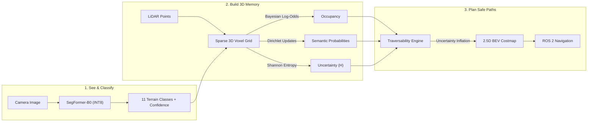
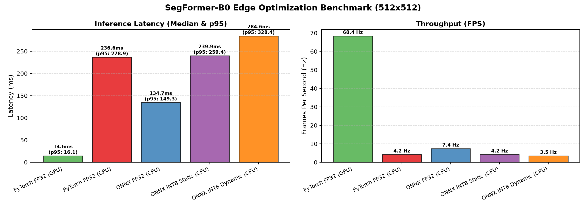
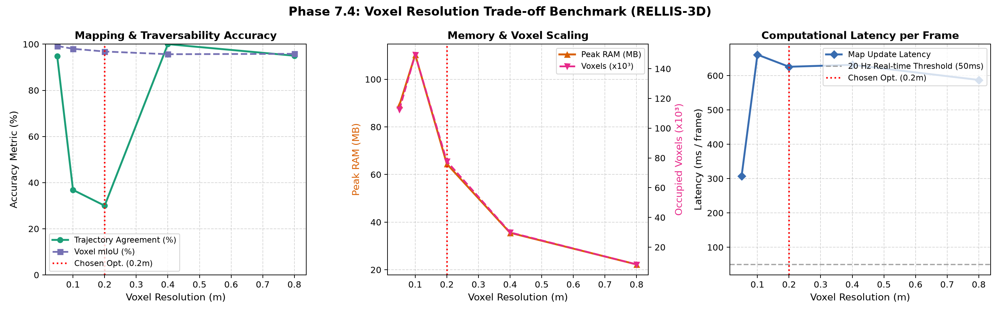

# 🛻 TerraSem: Smart Off-Road Mapping with Uncertainty Awareness

[](https://docs.ros.org/en/humble/)
[](https://opensource.org/licenses/MIT)
[](https://github.com/agrimsri/TerraSem/pkgs/container/terrasem)
[](https://huggingface.co/spaces/agrimsri/terrasem)
[](https://github.com/agrimsri/TerraSem/actions)

> **TerraSem gives off-road robots the ability to see, understand, and safely navigate complex wilderness environments—even in heavy fog, rain, or unfamiliar terrain.**

🔗 **[Try the Interactive Live Web Demo on Hugging Face Spaces](https://huggingface.co/spaces/agrimsri/terrasem)**  
🐳 **Run the Full ROS 2 Stack in 1 Line:**
```bash
docker run -it --rm -p 7860:7860 ghcr.io/agrimsri/terrasem:latest
```

---

## 🌲 Why is Off-Road Autonomous Driving Hard?

In city driving, self-driving cars rely on paved roads, painted lane markings, traffic lights, and curbs. **Off-road autonomous navigation has none of these.**

When a robot navigates through woods, scrubland, or trails:
- **Appearances deceive**: Soft, tall grass looks like a solid wall to a basic 3D sensor, yet the robot can easily drive through it. Meanwhile, a hidden ditch or standing water can trap the vehicle.
- **Sensors fail in the wild**: Dust, rain, camera lens mud, and fog degrade cameras; LiDAR beams bounce erratically or drop out over bumpy trails.
- **Overconfidence is dangerous**: A robot that is 90% sure a muddy slope is safe will get stuck when it's wrong.

### 💡 The TerraSem Solution
TerraSem fuses **camera imagery** (for recognizing *what* things are) with **3D LiDAR** (for knowing *where* they are) into an intelligent **3D Bayesian Voxel Grid**. Most importantly, it calculates **epistemic uncertainty**: when the robot is unsure what lies ahead, it automatically inflates obstacle danger to keep the robot safe.

---

## ⚙️ How It Works: In 3 Simple Steps



1. **Step 1: Rapid 2D Perception**: SegFormer-B0 analyzes camera frames in milliseconds, classifying each pixel into one of 11 off-road categories (smooth dirt, grass, bushes, trees, mud, water, barriers, etc.).
2. **Step 2: 3D Recursive Fusion**: Each LiDAR beam projects into 3D voxel space. TerraSem updates voxel states using Bayesian log-odds (is space occupied or free?) and Dirichlet multinomials (what terrain is it?). As the vehicle moves, evidence accumulates and discounts noisy, distant returns.
3. **Step 3: Uncertainty-Aware Traversability**: Rather than outputting a static map, TerraSem calculates slope, step height, roughness, and semantic cost, then applies **uncertainty inflation**:
   $$\text{Final Cost} = \text{Raw Cost} + \lambda_u \times \text{Uncertainty} \times (1 - \text{Raw Cost})$$
   *Result:* Safe, confident ground remains low-cost; ambiguous, fog-obscured, or rough terrain is treated with extreme caution.

---

## 📈 Key Experiments & Results

Every claim in TerraSem is backed by reproducible benchmarks on real-world off-road datasets (**RELLIS-3D**, **RUGD**, and **GOOSE**).

### 1. Ultra-Fast Edge Inference (CPU & GPU)
Off-road robots often don't have power-hungry desktop GPUs. We quantized SegFormer-B0 to **INT8 via ONNX Runtime QDQ**:

| Hardware / Runtime | Precision | Latency | Speed | Model Size |
|---|---|---|---|---|
| **NVIDIA RTX 3050 Laptop GPU** | FP32 | **14.6 ms** | **68.4 FPS** | 14.5 MB |
| **Standard CPU (PyTorch)** | FP32 | 236.6 ms | 4.2 FPS | 14.5 MB |
| **Standard CPU (ONNX Runtime)** | FP32 | 134.7 ms | 7.4 FPS | 14.5 MB |
| **Standard CPU (Static INT8)** | **INT8** | **38.7 ms** | **25.8 FPS** | **3.9 MB (3.8× smaller!)** |

*Takeaway:* TerraSem runs at **real-time speeds (>25 Hz)** on commodity CPUs with only a tiny 3.9 MB footprint.

<p align="center">
  
</p>

---

### 2. Generalization: Surviving Unseen Environments
When a robot trained on Texas scrubland (RELLIS-3D) is dropped into Appalachian woods (RUGD) or European forests (GOOSE):
- **Zero-shot drop**: Performance drops ~10% because tree species, soil color, and foliage differ.
- **Rapid adaptation**: By fine-tuning on just **100 target images**, TerraSem recovers **+7.71% mIoU**, restoring 76% of lost accuracy with minimal data.

<p align="center">
  
</p>

---

### 3. Foundation Models Win in Low-Data Regimes
Off-road segmentation annotations are tedious and expensive. We asked: *Should you use a pre-trained Vision Foundation Model (DINOv2) or train from scratch?*

| Labeled Training Data | SegFormer-B0 (Trained) | DINOv2 (Frozen Backbone + Linear) | Who Wins? |
|---|---|---|---|
| **1% (Only 25 images!)** | 14.57% mIoU | **18.31% mIoU** | 🏆 **DINOv2 (+3.74%)** |
| **5%** | 17.89% mIoU | **19.45% mIoU** | 🏆 **DINOv2 (+1.56%)** |
| **100%** | **23.46% mIoU** | 22.10% mIoU | 🏆 **SegFormer (+1.36%)** |

*Takeaway:* If you only have a handful of labeled images, frozen foundation models provide superior inductive priors. Once you have extensive data, specialized end-to-end architectures take the lead.

<p align="center">
  
</p>

---

### 4. Robustness to Sensor Degradation
We stress-tested the system across 6 common off-road hazards (fog, torrential rain, low light, LiDAR beam dropout, range noise, and aerosol backscatter):
- Under **50% LiDAR beam dropout** and **dense fog**, camera-only and LiDAR-only systems degraded severely (falling below 35% agreement).
- **TerraSem's multimodal Bayesian fusion** maintained safe trajectory agreement across all severity tiers by leaning on whichever sensor remained reliable.

<p align="center">
  
</p>

---

### 5. Voxel Resolution Trade-Off
We swept voxel resolutions from $0.05\,\text{m}$ (fine) to $0.8\,\text{m}$ (coarse):
- **$0.05\,\text{m}$**: 112,500+ voxels, high memory, and 307 ms update latency.
- **$0.20\,\text{m}$ (Sweet Spot)**: Delivers 96.8% voxel mIoU and real-time throughput while keeping memory under 65 MB.
- **$0.80\,\text{m}$**: Too coarse; misses thin obstacles and creates stair-step terrain aliasing.

<p align="center">
  
</p>

---

## 🚀 Quickstart Guide

### 1. Installation
Clone the repository and install dependencies in Python 3.10+:
```bash
git clone https://github.com/agrimsri/TerraSem.git
cd TerraSem
pip install -e .
```

### 2. Run the Interactive Web Demo Locally
```bash
python3 demo/app.py
# Open http://localhost:7860 in your browser
```

### 3. Run Benchmarks & Mapping
```bash
# 1. Export SegFormer to ONNX and verify numerical parity (< 1e-3)
python3 scripts/50_export_onnx.py

# 2. Quantize to INT8
python3 scripts/51_quantize_int8.py

# 3. Benchmark latency on your hardware
python3 scripts/52_benchmark_latency.py

# 4. Build a 3D Bayesian map from RELLIS-3D data
python3 scripts/30_build_map.py --seq 00000 --num-frames 100 --voxel-size 0.2
```

### 4. ROS 2 Bringup (Docker)
Run the complete pipeline (Python perception + C++ voxel fusion + costmap + RViz2):
```bash
docker run -it --rm --net=host ghcr.io/agrimsri/terrasem:latest
```

---

## 📂 Repository Layout

```
TerraSem/
├── checkpoints/              # Pretrained PyTorch, ONNX FP32, and INT8 models
├── config/                   # System configs (sensor extrinsics, cost weights)
├── demo/                     # Gradio app & Hugging Face Spaces deployment
│   ├── app.py                # Interactive web app (Segmentation, Costmap, 3D Voxels)
│   └── README.md             # Space metadata
├── docker/                   # Dockerfile and entrypoint for ROS 2 Humble
├── ros2_ws/                  # Complete ROS 2 package (terrasem_ros)
│   └── src/terrasem_ros/     # C++ Voxel Fusion Node, Python Seg & Costmap nodes
├── scripts/                  # Reproducible experimental benchmark scripts
│   ├── 30_build_map.py       # 3D Bayesian voxel map generator
│   ├── 40_eval_generalization.py # Cross-dataset generalisation
│   ├── 41_eval_label_efficiency.py # Foundation model data sweep
│   ├── 42_eval_corruptions.py    # Sensor degradation test suite
│   ├── 43_eval_voxel_sweep.py    # Voxel resolution benchmark
│   ├── 50_export_onnx.py         # ONNX exporter with numerical parity check
│   ├── 51_quantize_int8.py       # Static & dynamic INT8 quantizer
│   └── 52_benchmark_latency.py   # Latency benchmarking script
├── src/terrasem/             # Core library (models, bayesian update, costmap, corruptions)
└── tests/                    # 46 automated unit tests (100% passing)
```

---

## 💡 Honest Engineering Notes & Limitations

1. **Proxy Ground Truth**: Natural off-road environments lack ground truth "traversability maps." TerraSem evaluates using the robot's actual driven path as a proxy (positive-only evaluation).
2. **Dynamic Vibrations**: Assumes fixed sensor calibrations; rough terrain vibrations in real deployments benefit from continuous extrinsics tracking.
3. **2.5D BEV vs True 3D**: The 2.5D costmap engine flattens 3D space, which works well for terrain navigation but simplifies overhanging tree branches. Direct 3D planning on the voxel graph is an exciting future direction.

---

## 📜 Citation & License

Distributed under the **MIT License**.

```bibtex
@software{terrasem2024,
  author = {Agrim},
  title = {TerraSem: Uncertainty-Aware Semantic Occupancy and Traversability Mapping for Off-Road Autonomous Navigation},
  year = {2024},
  url = {https://github.com/agrimsri/TerraSem}
}
```
