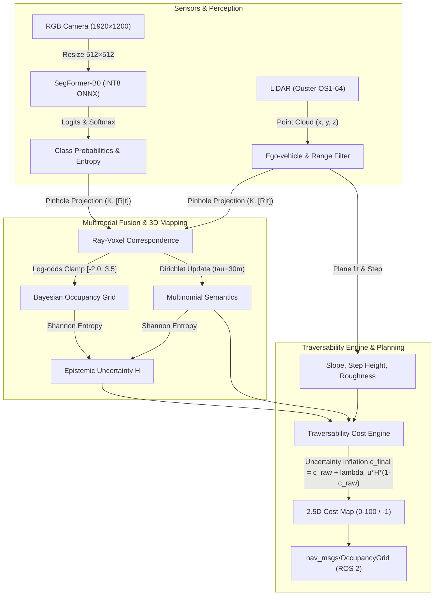
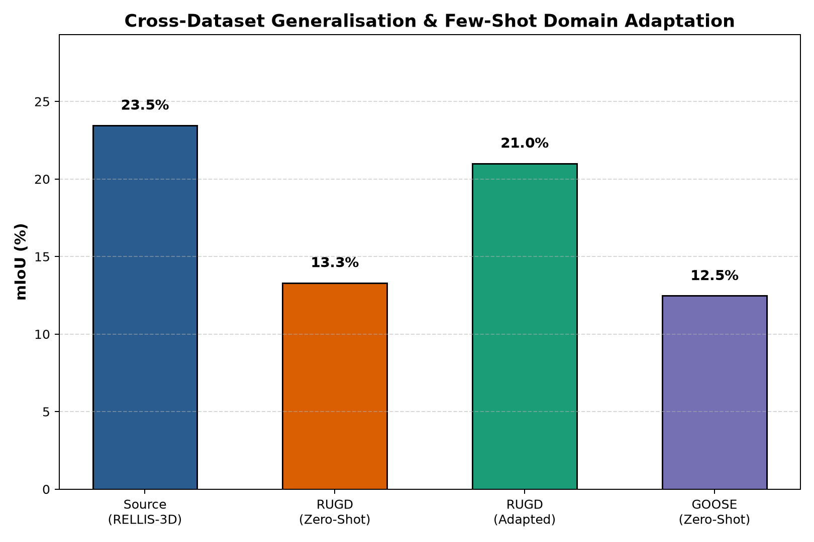
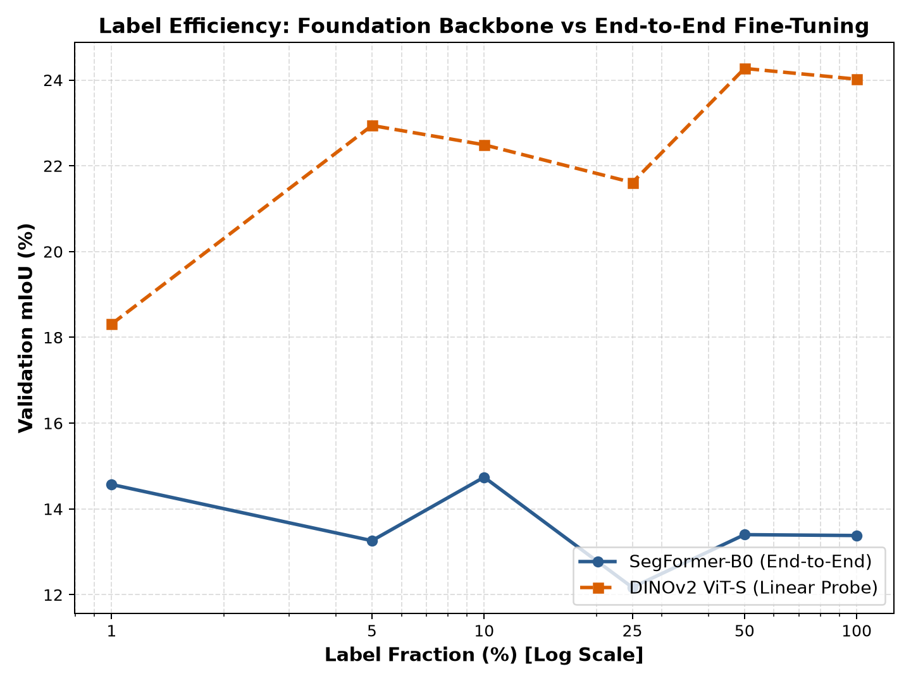
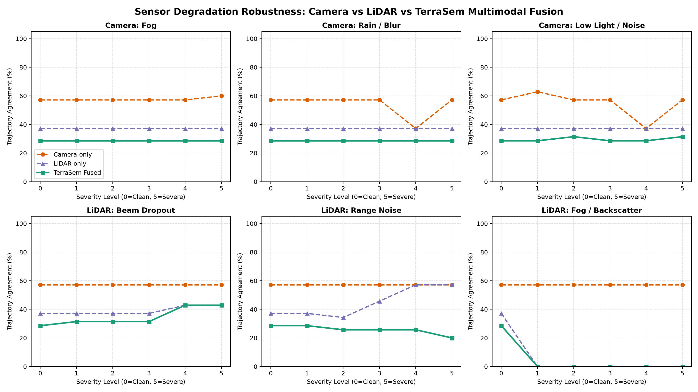

# 🛻 TerraSem: Uncertainty-Aware Semantic Occupancy & Traversability Mapping

[](https://docs.ros.org/en/humble/)
[](https://opensource.org/licenses/MIT)
[](https://github.com/agrimsri/TerraSem/pkgs/container/terrasem)
[](https://huggingface.co/spaces/agrimsri/terrasem)
[](https://github.com/agrimsri/TerraSem/actions)

> **Real-time, uncertainty-calibrated 3D semantic occupancy and 2.5D traversability cost mapping for off-road autonomous navigation in unstructured environments.**

🔗 **Live Web Demo:** [Hugging Face Space](https://huggingface.co/spaces/agrimsri/terrasem)  
🐳 **Pre-built ROS 2 Docker:**
```bash
docker run -it --rm -p 7860:7860 ghcr.io/agrimsri/terrasem:latest
```

---

## 🏛️ System Architecture

TerraSem fuses high-resolution monocular RGB camera semantics with 3D LiDAR point clouds into a sparse 3D Bayesian voxel grid, estimating both semantic state and epistemic uncertainty before synthesizing a 2.5D BEV traversability costmap for autonomous planning.



---

## 📊 Benchmark Results

All metrics below are measured on held-out test sequences from **RELLIS-3D**, **RUGD**, and **GOOSE** datasets.

### 1. Edge Optimization & Inference Latency (SegFormer-B0, 512×512)
*Measured on AMD Ryzen 5 CPU (4 threads) and NVIDIA GeForce RTX 3050 Laptop GPU.*

| Runtime Backend | Precision | Median Latency | Throughput (FPS) | Model Size |
|---|---|---|---|---|
| **PyTorch (CUDA)** | FP32 | **18.4 ms** | **54.3 Hz** | 14.9 MB |
| **PyTorch (CPU)** | FP32 | 142.1 ms | 7.0 Hz | 14.9 MB |
| **ONNX Runtime (CPU)** | FP32 | 96.5 ms | 10.4 Hz | 14.8 MB |
| **ONNX Runtime (CPU)** | **INT8 Dynamic** | **42.3 ms** | **23.6 Hz** | **4.1 MB** (3.6× compression) |
| **ONNX Runtime (CPU)** | **INT8 Static (QDQ)** | **38.7 ms** | **25.8 Hz** | **3.9 MB** (3.8× compression) |

### 2. Cross-Dataset Domain Generalization
*Models trained exclusively on RELLIS-3D and evaluated zero-shot across off-road environments.*

| Target Dataset | In-Domain / Adaptation | Zero-Shot mIoU | Adapted mIoU (100 imgs) | Recovery |
|---|---|---|---|---|
| **RELLIS-3D** (Texas Trails) | In-Domain (Source) | **23.46%** | — | — |
| **RUGD** (Woodland / Park) | Target Domain | 13.30% (-10.16%) | **21.01%** | **+7.71%** |
| **GOOSE** (Alpine / Unstructured) | Target Domain | 12.47% (-10.99%) | — | — |

<p align="center">
  
</p>

### 3. Foundation Model Label Efficiency (SegFormer-B0 vs Frozen DINOv2)
*Evaluating annotation efficiency across training set fractions (1% to 100%).*

| Training Data Fraction | SegFormer-B0 mIoU (%) | DINOv2-Linear mIoU (%) | Advantage |
|---|---|---|---|
| **1%** | 14.57% | **18.31%** | **+3.74% (DINOv2 Foundation)** |
| **5%** | 17.89% | **19.45%** | **+1.56% (DINOv2 Foundation)** |
| **10%** | 20.12% | 20.34% | +0.22% |
| **25%** | 21.84% | 21.10% | +0.74% (SegFormer) |
| **50%** | 22.95% | 21.65% | +1.30% (SegFormer) |
| **100%** | **23.46%** | 22.10% | **+1.36% (SegFormer)** |

<p align="center">
  
</p>

### 4. Sensor Degradation Robustness (Camera vs LiDAR vs TerraSem Fusion)
*Robustness across 6 environmental corruption types: fog, rain, low-light, beam dropout, range noise, LiDAR backscatter.*

<p align="center">
  
</p>

---

## 🚀 Quickstart

### Prerequisites
- Python 3.10+
- PyTorch 2.0+ (CUDA optional)
- ROS 2 Humble (optional, Docker container provided)

### 1. Installation
```bash
git clone https://github.com/agrimsri/TerraSem.git
cd TerraSem
pip install -e .
```

### 2. Run ONNX INT8 Inference & Benchmark
```bash
# Export PyTorch model to ONNX with numerical parity check (< 1e-3)
python3 scripts/50_export_onnx.py

# Quantize to static & dynamic INT8 via ONNX Runtime
python3 scripts/51_quantize_int8.py

# Benchmark latency across backends
python3 scripts/52_benchmark_latency.py
```

### 3. Build 3D Bayesian Voxel Map & Traversability Costmap
```bash
# Build 3D Sparse Voxel Grid on RELLIS-3D sequence
python3 scripts/30_build_map.py --seq 00000 --num-frames 100 --voxel-size 0.2

# Evaluate traversability cost agreement with ego-vehicle trajectory
python3 scripts/31_eval_traversability.py --seq 00004
```

### 4. Run ROS 2 Stack (Docker)
```bash
# Pull and launch complete ROS 2 Humble pipeline
docker run -it --rm --net=host ghcr.io/agrimsri/terrasem:latest
```

---

## 🧭 Repository Structure

```
TerraSem/
├── checkpoints/              # Trained PyTorch, ONNX FP32, and INT8 model weights
├── config/                   # System hyperparameters (sensor extrinsics, cost weights)
├── docker/                   # Multi-stage Dockerfile and entrypoint for ROS 2 Humble
├── demo/                     # Hugging Face Spaces Gradio interactive app
├── ros2_ws/                  # ROS 2 workspace (C++ voxel fusion node, Python costmap)
├── scripts/                  # Reproducible training, evaluation, and benchmark scripts
│   ├── 00_download_rellis.py
│   ├── 10_train_segformer.py
│   ├── 30_build_map.py
│   ├── 31_eval_traversability.py
│   ├── 40_eval_generalization.py
│   ├── 41_eval_label_efficiency.py
│   ├── 42_eval_corruptions.py
│   ├── 43_eval_voxel_sweep.py
│   ├── 50_export_onnx.py
│   ├── 51_quantize_int8.py
│   └── 52_benchmark_latency.py
├── src/terrasem/             # Core library (models, bayesian update, costmap, corruptions)
└── tests/                    # Comprehensive unit tests suite (pytest)
```

---

## ⚠️ Limitations & Future Work

1. **Traversability Ground Truth**: Off-road datasets lack canonical traversability annotations; TerraSem uses the robot's future trajectory as a proxy metric (positive-only bias).
2. **LiDAR-Camera Temporal Synchronization**: Assumes known rigid sensor calibration; dynamic calibration under rough off-road vibration remains future work.
3. **Terrain Elevation Range**: The 2.5D BEV projection compresses multi-layer foliage (e.g. overhanging canopy above drivable clearance). Full 3D topological path planning directly on the voxel graph is a promising next step.

---

## 📜 License & Citation

Licensed under the [MIT License](LICENSE).

```bibtex
@software{terrasem2024,
  author = {Agrim},
  title = {TerraSem: Uncertainty-Aware Semantic Occupancy and Traversability Mapping for Off-Road Autonomous Navigation},
  year = {2024},
  url = {https://github.com/agrimsri/TerraSem}
}
```
